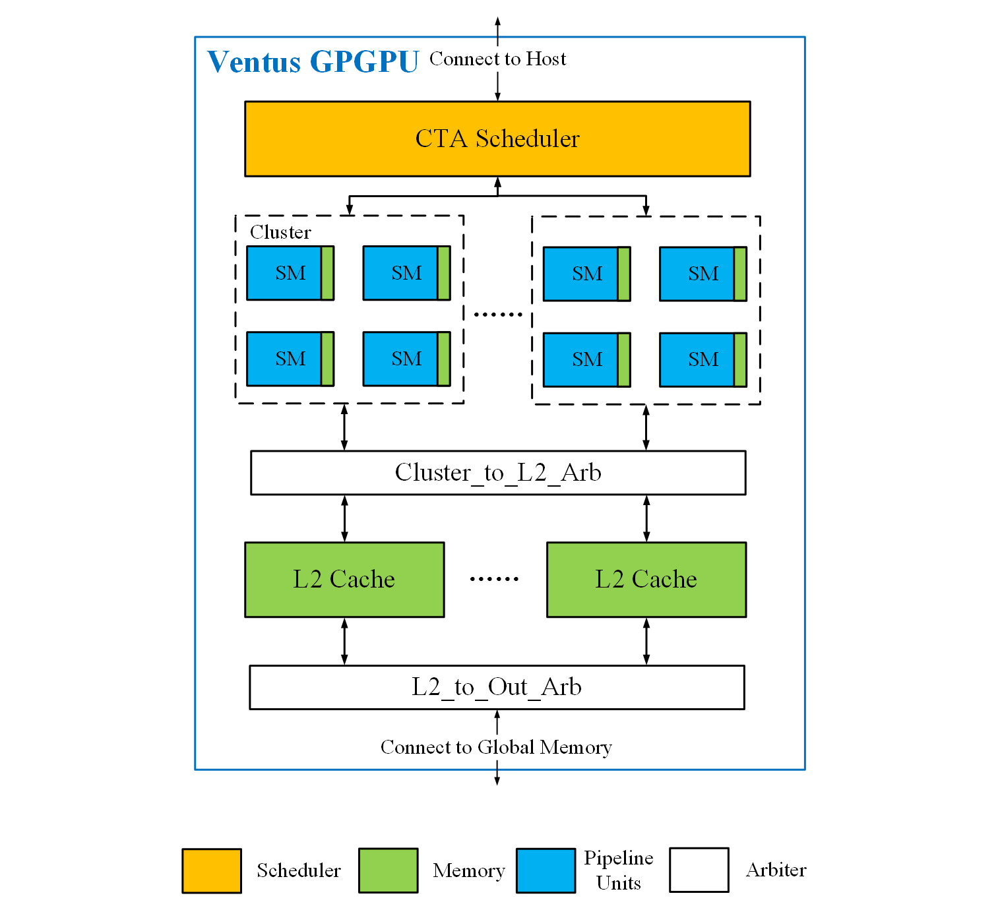
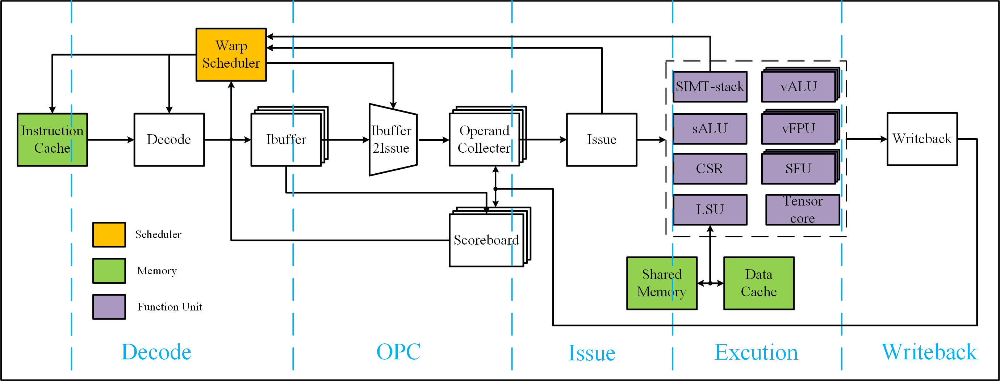
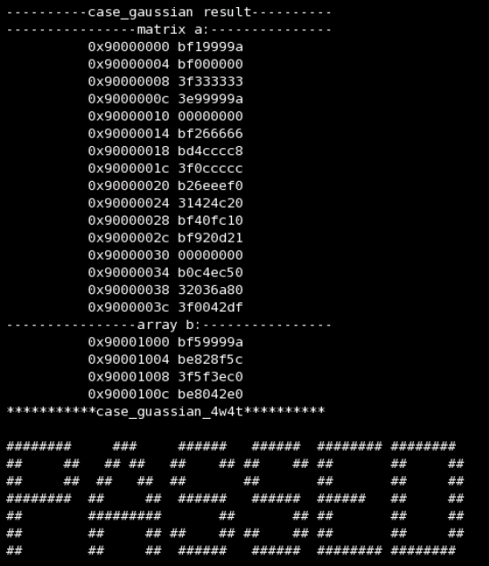

# Ventus GPGPU(Verilog版本)

GPGPU processor supporting RISCV-V extension, developed with Verilog.

Copyright (c) 2023-2024 C\*Core Technology Co.,Ltd,Suzhou.

这是“乘影”的Verilog版本，原版（Chisel HDL）链接在[这里](https://github.com/THU-DSP-LAB/ventus-gpgpu)

乘影开源GPGPU项目网站：[opengpgpu.org.cn](https://opengpgpu.org.cn/)

目前乘影在硬件设计上还有很多不足，如果您有意愿参与到“乘影”的开发中，欢迎在github上pull request

## 硬件架构

乘影的硬件架构文档在[这里](https://github.com/THU-DSP-LAB/ventus-gpgpu-verilog/blob/docs/docs/ventus-gpgpu-verilog-release-v1.0-spec.pdf)

承影的硬件结构框图:


SM核的硬件结构框图:


## 综合

我们针对GPGPU进行了DC综合（采用tsmc 28nm工艺）,以下是几个重要的配置参数：
- NUM\_THREAD = 32
- NUM\_SM = 2
- NUM\_WARP = 8
- DCACHE\_BLOCKWORDS = 2

在只采用HVT和SVT cell的条件下，GPGPU频率为**620MHz**，总面积为**3.908mm<sup>2</sup>**

## 开始

以gaussian用例为例，进入`testcase/test_gpgpu_axi_top/tc_gaussian`:

> 在仿真之前，需要确认GPGPU单个warp的大小：在`src/define/define.v`目录下，修改`NUM_THREAD`  

- 用VCS仿真:

```shell
make run-vcs-4w4t
```
- 结果会显示`PASSED`或`FAILED`:



- 用Verdi查看波形

```shell
make verdi
```

- 如果不需要对外的AXI接口，则进入`testcase/test_gpgpu_top/tc_gaussian`，步骤同上

## 测试用例说明

<table>
<tr>
<th>测试集</th>
<th>warp/thread数</th>
<th>是否通过</th>
<th>当前执行周期数</th>
<th>说明</th>
</tr>
<tr>
<td rowspan=4>vecadd：向量加法</td>
<td>4w16t</td>
<td>pass</td>
<td>1800</td>
<td>64个元素向量加</td>
</tr>
<tr>
<td>4w8t</td>
<td>pass</td>
<td>2696</td>
<td>64个元素向量加</td>
</tr>
<tr>
<td>4w32t</td>
<td>pass</td>
<td>2164</td>
<td>64个元素向量加</td>
</tr>
<tr>
<td>8w4t</td>
<td>pass</td>
<td>2899</td>
<td>64个元素向量加</td>
</tr>
<tr>
<td rowspan=4>matadd：矩阵加法</td>
<td>1w32t</td>
<td>pass</td>
<td>2808</td>
<td>4*4矩阵加法</td>
</tr>
<td>1w16t</td>
<td>pass</td>
<td>2500</td>
<td>4*4矩阵加法</td>
</tr>
<tr>
<td>2w8t</td>
<td>pass</td>
<td>2640</td>
<td>4*4矩阵加法</td>
</tr>
<tr>
<td>4w4t</td>
<td>pass</td>
<td>4054</td>
<td>4*4矩阵加法</td>
</tr>
<tr>
<td rowspan=5>nn：最近邻内插法</td>
<td>2w16t</td>
<td>pass</td>
<td>2031</td>
<td>19个点找最近的5个点</td>
</tr>
<tr>
<td>4w8t</td>
<td>pass</td>
<td>4033</td>
<td>28个点找最近的5个点</td>
</tr>
<tr>
<td>4w16t</td>
<td>pass</td>
<td>2269</td>
<td>53个点找最近的5个点</td>
</tr>
<tr>
<td>8w4t</td>
<td>pass</td>
<td>3382</td>
<td>19个点找最近的5个点</td>
</tr>
<tr>
<td>8w8t</td>
<td>pass</td>
<td>2038</td>
<td>53个点找最近的5个点</td>
</tr>
<tr>
<td rowspan=4>gaussian：高斯消元</td>
<td>1w16t</td>
<td>pass</td>
<td>10151</td>
<td>四元一次线性方程组消元</td>
</tr>
<tr>
<td>2w8t</td>
<td>pass</td>
<td>11670</td>
<td>四元一次线性方程组消元</td>
</tr>
<tr>
<td>4w4t</td>
<td>pass</td>
<td>11537</td>
<td>四元一次线性方程组消元</td>
</tr>
<tr>
<td>4w8t</td>
<td>pass</td>
<td>15940</td>
<td>五元一次线性方程组消元</td>
</tr>
<tr>
<td rowspan=4>bfs：宽度优先搜索算法</td>
<td>2w16t</td>
<td>pass</td>
<td>20938</td>
<td></td>
</tr>
<tr>
<td>4w8t</td>
<td>pass</td>
<td>22730</td>
<td></td>
</tr>
<tr>
<td>4w32t</td>
<td>pass</td>
<td>36114</td>
<td></td>
</tr>
<tr>
<td>8w4t</td>
<td>pass</td>
<td>40888</td>
<td></td>
</tr>
</table>

> 注：当前由于DCACHE\_BLOCKWORDS较小，执行周期数会比较长，当DCACHE\_BLOCKWORDS增大的时候，  
执行周期会有比较大的改善，这里只是为了评估不同NUM\_THREAD下GPGPU的执行效率

## 致谢

我们在开发Ventus GPGPU时参考了一些开源设计

| Sub module                | Source                                                                                       | Detail                                                                             |
|---------------------------|----------------------------------------------------------------------------------------------|------------------------------------------------------------------------------------|
| CTA scheduler             | [MIAOW](https://github.com/VerticalResearchGroup/miaow)                                      | Our CTA scheduler module is based on MiaoW ultra-threads dispatcher                |
| L2Cache                   | [block-inclusivecache-sifive](https://github.com/sifive/block-inclusivecache-sifive)         | Our L2Cache design is inspired by Sifive's block-inclusivecache                    |
| FPU                       | [XiangShan](https://github.com/OpenXiangShan/XiangShan)                                      | We reused Array Multiplier in XiangShan. FPU design is also inspired by XiangShan  |
| SFU                       | [openhwgroup](https://github.com/pulp-platform/fpu_div_sqrt_mvp)                             | Our SFU module is based on pulp-platform                                           |
| Config, ...               | [rocket-chip](https://github.com/chipsalliance/rocket-chip)                                  | Some modules are sourced from RocketChip                                           |
